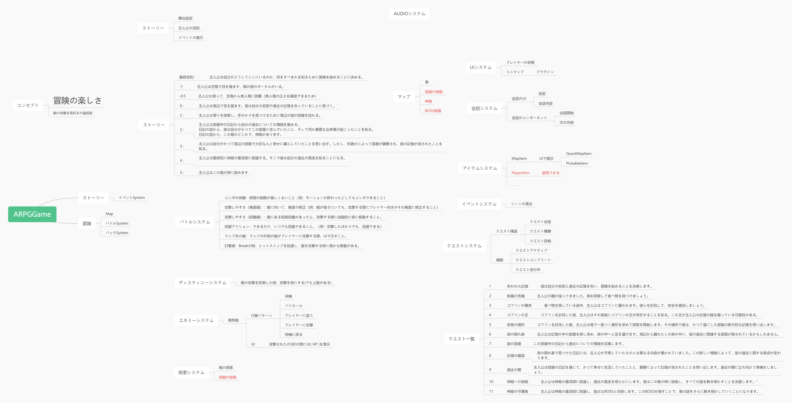
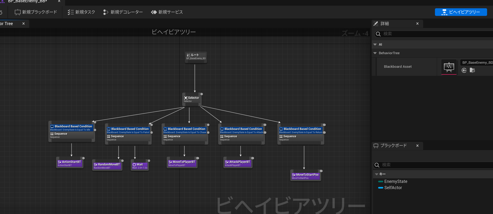
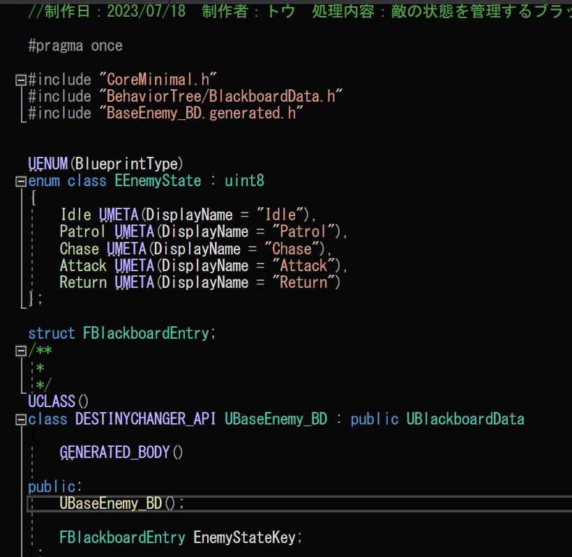

# DestinyChanger

## 1. プロジェクトの概要
趣味でARPGを作ってみました！

このプロジェクトは、TSGのプロジェクトに参加していた同時に、プライベートの時間を使って制作されました。ARPGの構造に興味を持っていたので、このジャンルのゲームを作成することにしました。


## 2. 技術的詳細
- **プログラミング言語**: C++
- **フレームワーク/エンジン**: Unreal Engine 5.1.1
- **使用ツール**: 例: Visual Studio, Visual Studio Code, git, github, photoshop

## 3. 機能説明
 
### バトルシステム
バトルシステムはプレイヤーのゲーム体験を向上させるためのいくつかの要素を取り入れて設計されています。

- **コンボの体験**: モーションが終わった後でも、時間の制限が厳しくないため、プレイヤーはコンボを続けることができます。
  
- **攻撃しやすさ（角度編）**: 敵に対しての位置取りが自動で調整され、敵が後ろにいてもプレイヤーはその方向に向き直ります。これにより、ゲームプレイがスムーズになります。
  
- **攻撃しやすさ（距離編）**: 敵との距離がある程度あっても、プレイヤーは自動的に前進して攻撃することができます。これにより、遠くの敵にも効果的に攻撃することができます。
  
- **回避アクション**: 攻撃直後でも、プレイヤーはすぐに回避行動を取ることができます。これにより、戦略的なバトルが可能になります。
  
- **マップ外の敵**: マップの外側からの敵の攻撃は、UIで明確に示されます。これにより、プレイヤーは予期しない攻撃から守ることができます。

- **打撃感**: 敵を攻撃する際、ヒットストップが発生し、敵に微かな移動が発生することで、打撃のリアルな感覚を提供します。

[→バトルシステムのコードを参照](#バトルシステムのコード部分)

### デスティニーシステム  
ディスティニーシステムは、プレイヤーが敵の攻撃をガードした際に、一時的にプレイヤーの攻撃力を増加させるシステムです。攻撃力の増加倍率は、時間の経過とともに徐々に減少します。また、このシステムの効果時間には上限が存在します。

このシステムは、プレイヤーが戦略的なガードを成功させた際に、一時的な攻撃力のブーストを提供することで、ゲームプレイのダイナミクスを高める効果が期待されます。

[→ディスティニーシステムのコードを参照](#ディスティニーシステムに関連する主要なコードの部分です)

### エネミーシステム
さまざまな種類の敵キャラクターがゲーム内に登場します。それぞれに独自の攻撃パターンと戦略があります。（まだ1種類しか実装してません。）

[→エネミーシステムのコードを参照](#エネミーシステムのコード部分)

### UIシステム
ゲームの進行状況、キャラクターの状態、敵の位置や方向などの情報をプレイヤーに表示します。

[→UIシステムのコードを参照](#UIシステムのコード部分)

### 会話システム
NPCとの対話を通じて、ストーリーが進行します。

[→会話システムのコードを参照](#会話システムのコード部分)

### アイテムシステム
プレイヤーはゲーム内でアイテムを探すことで、クエストの進捗を達成できます。

[→アイテムシステムのコードを参照](#アイテムシステムのコード部分)

### クエストシステム
クエストを通じて、プレイヤーはゲーム内のミッションを完了することができます。

[→クエストシステムのコードを参照](#クエストシステムのコード部分)


### 簡単な仕様図



## 4. ソースコードの説明とサンプル
このセクションでは、重要なコードスニペットを共有し、それらが何を実現するのか、なぜそれが重要で効率的なのかを説明します。
### バトルシステムのコード部分
```cpp

```

### ディスティニーシステムに関連する主要なコードの部分です。

```cpp
protected:
	//DestinySystem一回起動すると増える時間
	UPROPERTY(EditAnywhere, BlueprintReadOnly, Category = "DestinySystem", meta = (AllowPrivateAccess = "true"))
		float fDestinySystemAddTime;
	
	//DestinySystemの最大時間
	UPROPERTY(EditAnywhere, BlueprintReadOnly, Category = "DestinySystem", meta = (AllowPrivateAccess = "true"))
		float fDestinySystemTimeMax;

	//DestinySystemが一回発動
	void ExecuteDestinySystem();

	//タイマーに設定する時間
	float fDestinySystemTimerLength = 0.f;

	//タイマーに設定する時間を増やす
	void AddDestinySystemTimerLength();

	//TimerHandle
	FTimerHandle DestinySystemTimerHandle;

	//AttackPowerReset
	void AttackPowerReset();

	//Create AttackPowerReset Timer
	void CreateAttackPowerResetTimer();

	//AttackPowerの倍率
	float fDefaultAttackPowerRatio = 2.1f;

	float fAttackPowerRatio;

	//AttackPowerの倍率をリセット
	void AttackPowerRatioReset();

	//Get AttackPowerRatio
	float GetAttackPowerRatio();
```

機能詳細:
- **DestinySystemの起動時の時間増加**: `fDestinySystemAddTime` は、ディスティニーシステムが一度起動すると増加する時間を指定します。
- **DestinySystemの最大時間**: `fDestinySystemTimeMax` は、ディスティニーシステムの効果が継続する最大時間を定義します。
- **DestinySystemの実行**: `ExecuteDestinySystem()` 関数は、ガード成功時に攻撃力を倍増させる処理を行います。
- **タイマーの設定時間の追加**: `AddDestinySystemTimerLength()` 関数は、ディスティニーシステムの効果時間を増加させる処理を行います。
- **攻撃力のリセット**: `AttackPowerReset()` 関数は、ディスティニーシステムの効果が終了した際に、攻撃力の倍率を元に戻す処理を行います。
- **攻撃力倍率の取得**: `GetAttackPowerRatio()` 関数は、現在の攻撃力の倍率を取得する処理を行います。

### エネミーシステムのコード部分
エネミーシステムの構造は、Behavior Tree、AIController、Blackboard（AIのデータ）、AnimNotifyState（アニメーションが特定フレーム時の通知）、およびTaskNode（Taskの処理）の5つのコンポーネントから構成されています。

今回、Behavior TreeのBlackboardにはEnemyのステートのみが含まれており、各TaskNodeの処理やステートの切り替えは全てC++側で制御されています。

- **エネミーAIのBehavior Treeの処理**


- **エネミーAIのBlackboardの構造**


- **エネミーAIのTaskNode処理の一例**
  
この処理では、Enemyがプレイヤーに攻撃し、攻撃アニメーションが終了するとプレイヤーの追跡ステートに切り替わります。

```AttackPlayerBT.cpp
EBTNodeResult::Type UAttackPlayerBT::ExecuteTask(UBehaviorTreeComponent& OwnerComp, uint8* NodeMemory)
{
	bIsAttackEnd = false;

	//敵の取得
	AEnemyBase* Enemy = GetEnemy(OwnerComp);

	if (Enemy == nullptr) 	return EBTNodeResult::Failed;
	if (Enemy->AttackAnimMontage == nullptr) 	return EBTNodeResult::Failed;

	//Playerの取得
	APawn* Player =  GetWorld()->GetFirstPlayerController()->GetPawn() ;
	if (Player == nullptr) 	return EBTNodeResult::Failed;

	//敵の向きをプレイヤーの方向に向ける
	FRotator NewRot = (Player->GetActorLocation() - Enemy->GetActorLocation()).Rotation();
	NewRot.Pitch = 0.0f;
	NewRot.Roll = 0.0f;
	Enemy->SetActorRotation(NewRot);

	//Enemyのところを示すUIを表示
	Enemy->SetEnemyDirectionIndicatorActive(true);

	//攻撃のアニメーションを再生
	float tmp_TimeCount = Enemy->PlayAnimMontage(Enemy->AttackAnimMontage);

	//攻撃のアニメーションの再生時間を取得
	tmp_TimeCount *= Enemy->AttackAnimMontage->RateScale;

	//攻撃のアニメーションの再生時間分、攻撃を行わないようにする
	FTimerManager& TimerManager = GetWorld()->GetTimerManager();
	TimerManager.SetTimer(TimerHandle_AttackEnd, this, &UAttackPlayerBT::AttackEnd, tmp_TimeCount, false);

	return EBTNodeResult::InProgress;
}

void UAttackPlayerBT::TickTask(UBehaviorTreeComponent& OwnerComp, uint8* NodeMemory, float DeltaSeconds)
{
	if (bIsAttackEnd)	{
		//Stateをプレイヤーをプレイヤーに追跡のる状態に変更
		OwnerComp.GetBlackboardComponent()->SetValueAsEnum("EnemyState", (uint8)EEnemyState::Chase);

		FinishLatentTask(OwnerComp, EBTNodeResult::Succeeded);
	}
}

void UAttackPlayerBT::AttackEnd()
{
	bIsAttackEnd = true;
}
```

### UIシステムのコード部分
UIシステムは、プレイヤーのステータス、敵の方向を示す矢印とHP、会話ウィンドウ、およびミニマップ（UEのプラグインを使用）の4つのコンポーネントから構成されています。

- **プレイヤーのステータス**
この部分では、プレイヤーのステータスを取得し、Blueprint側でデータを受け取る処理を行っています。
  


```DestinyChangerCharacter.h
//////////////////////////////////////////////////////////////////////////
//UI
	////UI Class
	UPROPERTY( EditAnywhere, BlueprintReadWrite, Category = "UI")
		class UUserWidget* PlayerUI;

	//％を取得
	UFUNCTION(BlueprintCallable, Category = "UI")
		float GetHPPercent() { return HP / MaxHP; }

	//％を取得
	UFUNCTION(BlueprintCallable, Category = "UI")
		float GetGuardGaugePercent();
	float ADestinyChangerCharacter::GetAttackPower()
	{
		return MainWeapon->GetAttackPower() * fPower;
	}

	//攻撃力を取得
	UFUNCTION(BlueprintCallable, Category = "UI")
		float GetAttackPower();
	float ADestinyChangerCharacter::GetAttackPower()
	{
		return MainWeapon->GetAttackPower() * fPower;
	}

	//DestinySystemの残り時間を取得
	UFUNCTION(BlueprintCallable, Category = "UI")
		float GetDestinySystemTime();
	float ADestinyChangerCharacter::GetDestinySystemTime()
	{
		return GetWorld()->GetTimerManager().GetTimerRemaining(DestinySystemTimerHandle);
	}

	//Get Level Exp LevelUpExp Tuprle
	UFUNCTION(BlueprintCallable, Category = "UI")
		FLevelData GetLevelData() { return LevelData; }
```

- **敵の方向を示す矢印とHP**

この部分では、敵の方向を赤い矢印でUI上に表示し、敵がプレイヤーに攻撃する際にのみ矢印が表示されます。また、敵のHPはプレイヤーに攻撃された際にのみ表示されます。

- **敵の方向を示す矢印**
  
```EnemyTargeting.cpp
void UEnemyTargeting::NativeTick(const FGeometry& MyGeometry, float InDeltaTime)
{
	Super::NativeTick(MyGeometry, InDeltaTime);

	if (Enemy == nullptr || PlayerArrow == nullptr) {
		RemoveFromParent();
		return;
	}

	FRotator Rotator = GetLookAtRotationYaw();
	TargetingImage->SetRenderTransformAngle(Rotator.Yaw);
}

void UEnemyTargeting::Init(AActor* _Enemy, UArrowComponent* _PlayerArrow)
{
	Enemy = _Enemy;
	PlayerArrow = _PlayerArrow;
}

FRotator UEnemyTargeting::GetLookAtRotationYaw()
{
	if (Enemy == nullptr || PlayerArrow == nullptr) {
		RemoveFromParent();
		return FRotator();
	}

	FVector Start = Enemy->GetRootComponent()->GetComponentLocation();									//敵の位置
	FVector End = PlayerArrow->GetComponentLocation();		//プレイヤーの位置

	FVector Direction = End - Start;		//プレイヤーの位置から敵の位置を引く
	Direction *= -1;						//反転

	Direction.Normalize(0.0001);
	float EnemyYaw = Direction.Rotation().Yaw;			// 

	//-------------------------------Player-----------------------------------------
	auto tmp = PlayerArrow->GetForwardVector();
	tmp.Normalize(0.0001);
	float PlayerYaw = tmp.Rotation().Yaw;

	return FRotator(0, EnemyYaw - PlayerYaw, 0); //敵の向きとプレイヤーの方向の差分を返す
}


``

- **敵のHP　UI**
```Base_WidgetComponent.cpp
void UBase_WidgetComponent::BeginPlay()
{
	Super::BeginPlay();

	//ワールドで表示する
	SetWidgetSpace(EWidgetSpace::World);	
	if (WidgetClass != nullptr)	{
		SetWidgetClass(WidgetClass);	//BP側で設定したWidgetClassをセット
	}

	SetVisibility(false);	//最初は非表示
	
}

void UBase_WidgetComponent::TickComponent(float DeltaTime, ELevelTick TickType, FActorComponentTickFunction* ThisTickFunction)
{
	Super::TickComponent(DeltaTime, TickType, ThisTickFunction);

	LookAtPlayer();
}

//向きをプレイヤーに向ける
void UBase_WidgetComponent::LookAtPlayer()
{
	auto PlayerController = GetWorld()->GetFirstPlayerController();
	if (PlayerController)
	{
		//Get camera location
		APlayerCameraManager* CameraManager = PlayerController->PlayerCameraManager;
		if (CameraManager == nullptr) return;

		UCameraComponent* CameraComponent = Cast<UCameraComponent>(CameraManager->GetViewTarget()->GetComponentByClass(UCameraComponent::StaticClass()));
		if (CameraComponent == nullptr) return;

		FVector CameraLocation = CameraComponent->GetComponentLocation();
		//Look at camera
		FRotator LookAtRotation = UKismetMathLibrary::FindLookAtRotation(GetComponentLocation(), CameraLocation);

		//ReSet rotation
		LookAtRotation.Pitch = 0.0f;
		LookAtRotation.Roll = 0.0f;

		//Apply rotation
		SetWorldRotation(LookAtRotation);
	}
}

void UBase_WidgetComponent::ShowHPUI(float _time)
{
	//Component のActorを取得
	AActor* Owner = GetOwner();

	//Widgetを表示
	SetVisibility(true);

	Owner->GetWorldTimerManager().SetTimer(ShowUITimerHandle, this, &UBase_WidgetComponent::HideHPUI, _time, false);

}

void UBase_WidgetComponent::HideHPUI()
{
	//Component のActorを取得
	AActor* Owner = GetOwner();

	SetVisibility(false);

	Owner->GetWorldTimerManager().ClearTimer(ShowUITimerHandle);
}

void UBase_WidgetComponent::SetHPInfo(float HP, float MaxHP)
{
	if (WidgetClass != nullptr) {
		//Get Character Widget
		UCharacterBase_UMG* CharacterWidget = Cast<UCharacterBase_UMG>(GetWidget());
		if (CharacterWidget != nullptr) {
			//Set HP
			CharacterWidget->SetPlayerInfo(HP, MaxHP);
		}
		else {
			UE_LOG(LogTemp, Warning, TEXT("CharacterWidget is nullptr"));
		}
	}
}
```

- **会話ウィンドウ**

```cpp

``

### 会話システムのコード部分
```cpp

```

### アイテムシステムのコード部分
```cpp

```

### クエストシステムのコード部分
```cpp

```

## 5. 自分の役割と貢献
このプロジェクトは個人で開発されました。設計、プログラミング、テスト、およびデバッグの全てのフェーズを担当しました。このプロジェクトを通じて、自分自身の技術的能力を向上させ、独立してタスクを完了する能力を強化しました。


## 6. 成果と学び
このセクションでは、プロジェクトを通じて得られた成果や学びを共有します。

## 7. ビジュアルとメディア
  
[プロジェクトデモビデオ](https://youtu.be/-7P6c4o86i4)

## 8. プロジェクトのリンク
- [GitHubリポジトリ](https://github.com/yu-zuki/DestinyChanger)  
- [実行可能なデモ](https://demo_url)

## 9. 連絡先情報
- 名前: トウ　ゼイキ
- メール: touzeiki@gmail.com
